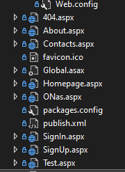
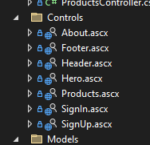
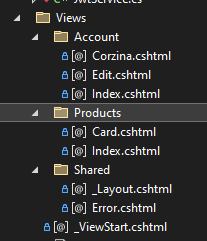

<h1>Проект состоит из веб-форм и компонентов razor pages (MVC)</h1>

<h2>Компоненты веб-форм:</h2>

<ul>
<li>404.aspx - страница 404</li>
<li>About.aspx - страница описания</li>
<li>Contacts.aspx - страница для связи</li>
<li>Homepage.aspx - главная страница</li>
<li>ONas.aspx - страница с описанием удочек</li>
<li>SignIn.aspx - страница  авторизации</li>
<li>SignUp.aspx - страница регистрации</li>
</ul>

<h2>Компоненты контроллеров:</h2>

<ul>
<li>About.aspx - компонент с описанием</li>
<li>Footer.aspx - компонент нижнего колонтитула</li>
 <li>Header.aspx - верхнего колонтитула</li>
 <li>Hero.aspx - компонент с приветствием на сайте</li>
 <li>Product.aspx - компонент товара</li>
 <li>SignIn.aspx - компонент формы авторизации</li>
 <li>SignUp.aspx - компонент формы регистрации</li>
</ul>

<h2>Компоненты представлений:</h2>

<ul>
<li>Account/Corzina.cshtml - компонент с корзиной</li>
<li>Account/Edit.cshtml- компонент редактирования профиля</li>
 <li>Account/Index.cshtml - верхнего профиля</li>
 <li>Products/Card.cshtml - компонент с карточкой товара</li>
 <li>Products/Index.cshtml - компонент списка товаров</li>
 
</ul>
